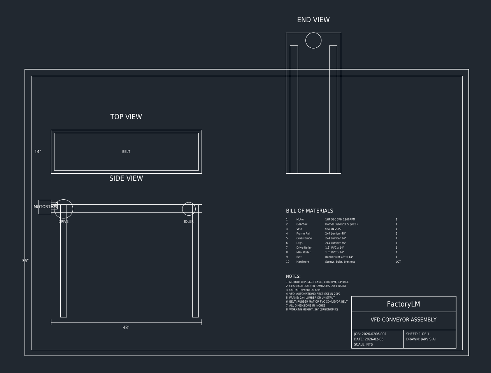

# VFD Conveyor Assembly - FactoryLM YC Demo
**Job #:** 2026-0206-001 | **Date:** 2026-02-06

## 📐 Mechanical Drawings

### Complete Assembly (3-View + BOM)

### Side View - Roller Detail

## ⚡ Electrical Diagrams

### VFD Wiring Schematic

### Motor Connection Detail  

---

## 📋 Documentation

- [Full Job Packet](JOB-PACKET.md) - Complete specifications
- [Bill of Materials](HOME-DEPOT-BOM.md) - Shopping list
- [Gearbox Report](DORNER-GEARBOX-REPORT.md) - Dorner 32M020HS compatibility

## 📁 CAD Files

- `conveyor_complete_2026-0206-001.dxf` - Full assembly drawing
- `conveyor_mechanical.dxf` - Mechanical detail

---

*Built for YC W26 Demo - FactoryLM*
